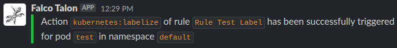
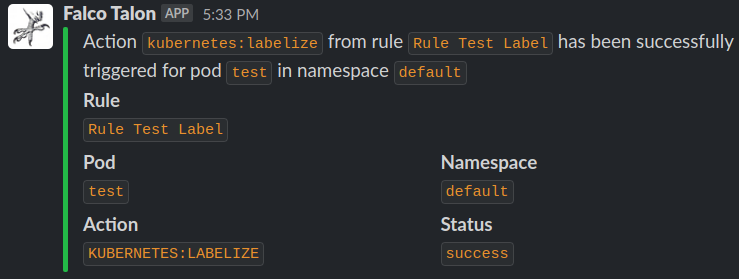
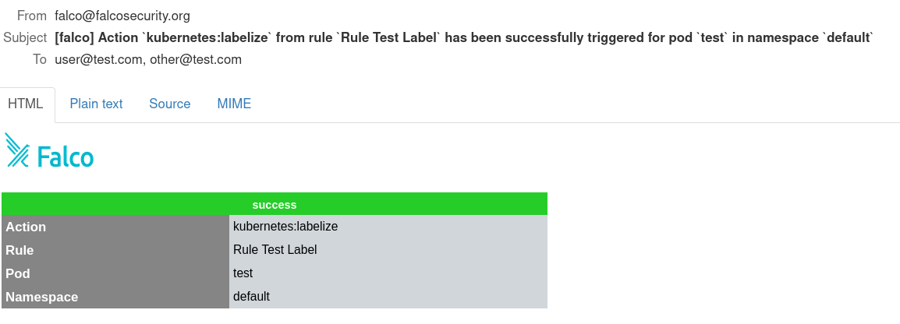
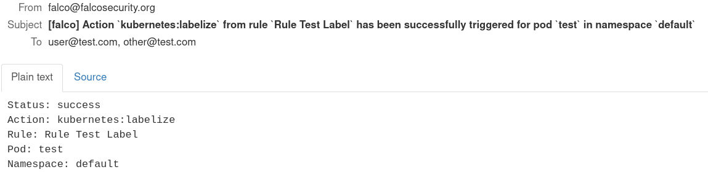

 # Falco Talon

`Falco Talon` is a Response Engine for managing threats in your Kubernetes. It enhances the solutions proposed by the Falco community with a no-code tailor made solution. With easy rules, you can react to `events` from [`Falco`](https://falco.org) in milliseconds.

- [Falco Talon](#falco-talon)
  - [Architecture](#architecture)
    - [Glossary](#glossary)
  - [Actionners](#actionners)
    - [`kubernetes:terminate`](#kubernetesterminate)
    - [`kubernetes:labelize`](#kuberneteslabelize)
    - [`kubernetes:networkpolicy`](#kubernetesnetworkpolicy)
    - [`kubernetes:exec`](#kubernetesexec)
    - [`kubernetes:script`](#kubernetesscript)
    - [`kubernetes:log`](#kuberneteslog)
  - [Notifiers](#notifiers)
    - [K8s Events](#k8s-events)
    - [Slack](#slack)
    - [Loki](#loki)
    - [Elasticsearch](#elasticsearch)
    - [SMTP](#smtp)
    - [Webhook](#webhook)
  - [Configuration](#configuration)
  - [Rules](#rules)
  - [Usage](#usage)
  - [Docker images](#docker-images)
  - [Deployment](#deployment)
    - [Helm](#helm)
      - [Configure Falcosidekick](#configure-falcosidekick)
  - [License](#license)
  - [Author](#author)

## Architecture

`Falco Talon` can receive the `events` from [`Falco`](https://falco.org) or [`Falcosidekick`](https://github.com/falcosecurity/falcosidekick):

```
┌──────────┐      ┌───────────────┐      ┌─────────────┐
│  Falco   ├──────► Falcosidekick ├──────► Falco Talon │
└──────────┘      └───────────────┘      └─────────────┘
or
┌──────────┐      ┌─────────────┐
│  Falco   ├──────► Falco Talon │
└──────────┘      └─────────────┘
```

### Glossary

* `event`: an event detected by `Falco` and sent to its outputs
* `rule`: defines criterias for linking the events with the actions to apply
* `action`: each rule can sequentially run actions, each action refers to an actionner
* `actionner`: defines what to the action will do
* `notifier`: defines what outputs to notify with the result of the action

## Actionners

`Actionners` define actions to apply when an event matches a rule, they are named with pattern `category:action`.
`category` allows to group `actions` and avoid multiple initializations (eg, multi Kubernetes API client, multi AWS clients, ...).

Each `actionner` is configured with:
* `parameters`: `key:value` map of parameters passed to the action, the value can be a string, a list (array) or a map (map[string]string). Example: list of `labels` for `kubernetes:labelize`.

> **Warning**
> Some actionners have by default the `Continue: false` setting, this stops the evaluation of the next actions of the rule. If can be overridden.

### `kubernetes:terminate`

* Description: **Terminate pod**
* Continue: `false`
* Parameters:
  * `grace_period_seconds`: The duration in seconds before the pod should be deleted. The value zero indicates delete immediately.
  * `ignore_daemonsets`: If true, the pods which belong to a Daemonset are not terminated.
  * `ignore_statefulsets`: If true, the pods which belong to a Statefulset are not terminated.
  * `min_healthy_replicas`: Minimum number of healthy pods to allow the termination, can be an absolute or % value (the value must be a quoted string).
* Required fields:
  * `k8s.pod.name`
  * `k8s.ns.name`

### `kubernetes:labelize`

* Description: **Add, modify or delete labels of pod**
* Continue: `true`
* Parameters: 
  * `labels`: key:value map of labels to add/modify/delete (empty value means label deletion)
* Required fields:
  * `k8s.pod.name`
  * `k8s.ns.name`

### `kubernetes:networkpolicy`

* Description: **Create, update a network policy to block all egress traffic for pod**
* Continue: `true`
* Parameters:
  * `allow`: list of CIDR to allow anyway (eg: private subnets)
* Required fields:
  * `k8s.pod.name`
  * `k8s.ns.name`

### `kubernetes:exec`

* Description: **Exec a command in a pod**
* Continue: `true`
* Parameters:
  * `shell`: SHELL used to run the command (default: `/bin/sh`)
  * `command` Command to run
* Required fields:
  * `k8s.pod.name`
  * `k8s.ns.name`

### `kubernetes:script`

* Description: **Run a script in a pod**
* Continue: `true`
* Parameters:
  * `shell`: SHELL used to run the script (default; `/bin/sh`)
  * `script`: Script to run (use `|` to use multilines) (can't be used at the same time than `file`)
  * `file`: Shell script file (can't be used at the same time than `script`)
* Required fields:
  * `k8s.pod.name`
  * `k8s.ns.name`

### `kubernetes:log`

* Description: **Get logs from a pod**
* Continue: `true`
* Parameters:
  * `tail_lines`: The number of lines from the end of the logs to show (default: `1000`)
* Required fields:
  * `k8s.pod.name`
  * `k8s.ns.name`

## Notifiers

`Notifiers` define which outputs to notify with result of actions.

### K8s Events

This notifiers creates a [k8s event](https://kubernetes.io/docs/reference/generated/kubernetes-api/v1.19/#event-v1-events-k8s-io) in the target resource namespace. No configuration is requested.

### Slack

|    Setting    |                                      Default                                      |        Description         |         |
| ------------- | --------------------------------------------------------------------------------- | -------------------------- | ------- |
| `webhook_url` | n/a                                                                               | Webhook URL                |         |
| `icon`        | `https://upload.wikimedia.org/wikipedia/commons/2/26/Circaetus_gallicus_claw.jpg` | Avatar for messages        |         |
| `username`    | `Falco Talon`                                                                     | Username for messages      |         |
| `footer`      | `https://github.com/Issif/falco-talon`                                            | Footer for messages        |         |
| `format`      | `long`                                                                            | Format for messages (`long | short`) |

Results:




### Loki

|     Setting      | Default |         Description          |
| ---------------- | ------- | ---------------------------- |
| `url`            | n/a     | http://{domain or ip}:{port} |
| `user`           | n/a     | User for Grafana Logs        |
| `api_key`        | n/a     | API Key for Grafana Logs     |
| `tenant`         | n/a     | Add the Tenant header        |
| `custom_headers` | n/a     | Custom HTTP Headers          |

### Elasticsearch

|     Setting      |    Default    |                                    Description                                    |
| ---------------- | ------------- | --------------------------------------------------------------------------------- |
| `host_port`      | n/a           | http://{domain or ip}:{port}                                                      |
| `user`           | n/a           | User for Grafana Logs                                                             |
| `password`       | n/a           | Password for Grafana Logs                                                         |
| `index`          | `falco-talon` | Elasticsearch index                                                               |
| `suffix`         | `daily`       | Date suffix for index rotation : `daily` (default), `monthly`, `annually`, `none` |
| `custom_headers` | n/a           | Custom HTTP Headers                                                               |

### SMTP

|   Setting   | Default |              Description              |
| ----------- | ------- | ------------------------------------- |
| `host_port` | n/a     | Host:Port of SMTP server              |
| `user`      | n/a     | User for SMTP                         |
| `password`  | n/a     | Password for SMTP                     |
| `from`      | n/a     | From                                  |
| `to`        | n/a     | To (comma separated list of adresses) |
| `format`    | `html`  | Format of the email (`text`, `html`)  |
| `tls`       | `false` | Use TLS connection                    |

Results:




### Webhook

|     Setting      |              Default              |     Description     |
| ---------------- | --------------------------------- | ------------------- |
| `url`            | n/a                               | URL                 |
| `http_method`    | `POST`                            | HTTP Method         |
| `user_agent`     | `Falco-Talon`                     | User Agent          |
| `content_type`   | `application/json; charset=utf-8` | Content Type        |
| `custom_headers` | n/a                               | Custom HTTP Headers |

Results:
```json
{"pod":"test","namespace":"default","action":"kubernetes:labelize","status":"success"}
```

## Configuration

The static configuration of `Falco Talon` is set with a `.yaml` file (default: `./config.yaml`) or with environment variables.

|       Setting       |       Env var       |  Default  |                           Description                           |
| ------------------- | ------------------- | :-------: | --------------------------------------------------------------- |
| `listen_address`    | `LISTEN_ADDRESS`    | `0.0.0.0` | Listten Address                                                 |
| `listen_port`       | `LISTEN_PORT`       |  `2803`   | Listten Port                                                    |
| `rules_files`       | `RULES_FILES`       |    n/a    | File with rules                                                 |
| `watch_rules`       | `WATCH_RULES`       |  `true`   | Reload rules if they change                                     |
| `print_all_events`  | `PRINT_ALL_EVENTS`  |  `true`   | Print in logs all received events, not only those which match   |
| `kubeconfig`        | `KUBECONFIG`        |    n/a    | Kube config file, only if `Falco Talon` runs outside Kubernetes |
| `log_format`        | `LOG_FORMAT`        |  `color`  | Log Format: text, color, json                                   |
| `default_notifiers` | `DEFAULT_NOTIFIERS` |    n/a    | List of `notifiers` which are enabled for all rules             |
| `notifiers_x`       | `NOTIFIERS_X`       |    n/a    | List of `notifiers` with their settings                         |

Example:

```yaml
listen_address: "0.0.0.0"
listen_port: "2803"
rules_files: "./rules.yaml"
kubeconfig: "./kubeconfig.yaml"

default_notifiers:
  - slack

notifiers:
  slack:
    webhook_url: "https://hooks.slack.com/services/XXXX"
    username: "Falco Talon"
    footer: ""
```

## Rules

> **Note**
> The rules are evaluated from top to bottom.
> Multiple rules files can be used (repeat the `-r` flag), the first file is overriden by the following ones (strings are replaced, lists are appended, ...).

The syntax for the rules files is:

```yaml
- action: <string,mandatory>
  actionner: <string,mandatory>
  continue: <bool>
  ignore_errors: <bool>
  parameters:
    <string>: <string>
    <string>:
      - <string>
      - <string>
    <string>:
      <string>: <string>
      <string>: <string>

- rule: <string,mandatory>
  match:
    rules:
      - <string>
      - <string>
    priority: <string>
    tags:
      - <string>, <string>, <string>
      - <string>, <string>
    output_fields:
      - <string>=<string>, <string>=<string>
      - <string>!=<string>, <string>=<string>
  continue: <bool>
  dry_run: <bool>
  actions:
    - action: <string,mandatory>
    - action: <string,mandatory>
      actionner: <string,mandatory>
      continue: <bool>
      ignore_errors: <bool>
      parameters:
        <string>: <string>
        <string>:
          - <string>
          - <string>
        <string>:
          <string>: <string>
          <string>: <string>
  notifiers:
    - <string>
    - <string>
```

The rules files contain 2 types of blocks: 
* `action`: defines an action that can be reused by different rules
* `rule`: defines a rule to match with events and run actions

For the `action` block, the settings are:
* `action`: (*mandatory*) name of action to trigger
* `actionner`: name of the actionner to use
* `continue`: if `true`, no more action are applied after this one (each actionner has its own default value).
* `ignore_errors`: if `true`, ignore the errors and avoid to stop at this action.
* `parameters`: key:value map of parameters for the action. value can be a string, an array (slice) or a map.

For the `rule` block, the settings are:
* `rule`: (*mandatory*) Name of your rule
* `match`: the section to define the criterias to match
  * `rules`: (*list*) (`OR` logic) Falco rules to match. If empty, all rules match.
  * `priority`: Priority to match. If empty, all priorities match. Syntax is like: `>=Critical`, `<Warning`, `Debug`.
  * `tags`: (*list*) (`OR` logic) Comma separated lists of Tags to match (`AND` logic). If empty, all tags match.
  * `output_fields`: (*list*) (`OR` logic) Comma separated lists of key:comparison:value for Output fields to match (`AND` logic). If emtpy, all output fields match.
* `actions`: the list of actions to sequentially run, they can refer to an `action` block or defined locally 
  * `action`: (*mandatory*) name of action to trigger, can refer to an `action` block
  * `actionner`: name of the actionner to use
  * `continue`: if `true`, no more action are applied after this one (each actionner has its own default value).
  * `ignore_errors`: if `true`, ignore the errors and avoid to stop at this action.
  * `parameters`: key:value map of parameters for the action. value can be a string, an array (slice) or a map.
* `continue`: if `true`, no more rule are compared after the rule has been triggered (default is `true`).
* `dry_run`: if `true`; the action is not applied (default: `false`).
* `notifiers`: list of notifiers to enabled for the action, in addition with the defaults.

Examples:

```yaml
- action: Terminate Pod
  actionner: kubernetes:terminate
  parameters:
    ignoreDaemonsets: false
    ignoreStatefulsets: true

- action: Disable outbound connections
  actionner: kubernetes:networkpolicy
  parameters:
    allow:
      - "192.168.1.0/24"
      - "172.17.0.0/16"
      - "10.0.0.0/32"

- rule: Suspicious outbound connection
  match:
    rules:
      - Unexpected outbound connection destination
  actions:
    - action: Disable outbound connections
      ignore_errors: true
    - action: Terminate Pod # ref to a re-usable action
      parameters:
        gracePeriods: 2
```

## Usage

```shell
$ falco-talon --help

Falco Talon is a Response Engine for managing threats in Kubernetes 
It enhances the solutions proposed by Falco community with a dedicated, 
no-code solution. With easy rules, you can perform actions over compromised pods

Usage:
  falco-talon [command]

Available Commands:
  check       Check Falco Talon Rules file
  completion  Generate the autocompletion script for the specified shell
  help        Help about any command
  server      Start Falco Talon
  version     Print version of Falco Talon.

Flags:
  -c, --config string       Falco Talon Config File (default "/etc/falco-talon/config.yaml")
  -h, --help                help for falco-talon
  -r, --rules stringArray   Falco Talon Rules File (default [/etc/falco-talon/rules.yaml])

Use "falco-talon [command] --help" for more information about a command.
```

```shell
$ falco-talon server --help

Start Falco Talon

Usage:
  falco-talon server [flags]

Flags:
  -h, --help   help for server

Global Flags:
  -c, --config string       Falco Talon Config File (default "/etc/falco-talon/config.yaml")
  -r, --rules stringArray   Falco Talon Rules File (default [/etc/falco-talon/rules.yaml])
```

```shell
$ falco-talon check --help

Check Falco Talon Rules file

Usage:
  falco-talon check [flags]

Flags:
  -h, --help   help for check

Global Flags:
  -c, --config string       Falco Talon Config File (default "/etc/falco-talon/config.yaml")
  -r, --rules stringArray   Falco Talon Rules File (default [/etc/falco-talon/rules.yaml])
```

## Docker images

The docker images for `falco-talon` are built using [ko](https://github.com/google/ko)

To generate the images to test locally you can run `mage buildImagesLocal`

## Deployment

### Helm

The helm chart is available in the folder [`deployment/helm`](https://github.com/Issif/falco-talon/tree/main/deployment/helm).
Two config files are provided:
* `values.yaml` allows you to configure `Falcon Talon` and the deployment
* `rules.yaml` contains rules to set

```shell
cd deployment/helm/
helm install falco-talon . -n falco --create-namespace
```

#### Configure Falcosidekick

Once you have installed `Falco Talon` with Helm, you need to connect `Falcosidekick` by adding the flag `--set falcosidekick.config.webhook.address=http://falco-talon:2803`
```shell
helm install falco falcosecurity/falco --namespace falco \
  --create-namespace \
  --set tty=true \
  --set falcosidekick.enabled=true \
  --set falcosidekick.config.webhook.address=http://falco-talon:2803
```

## License

MIT

## Author

Thomas Labarussias (https://github.com/Issif)

