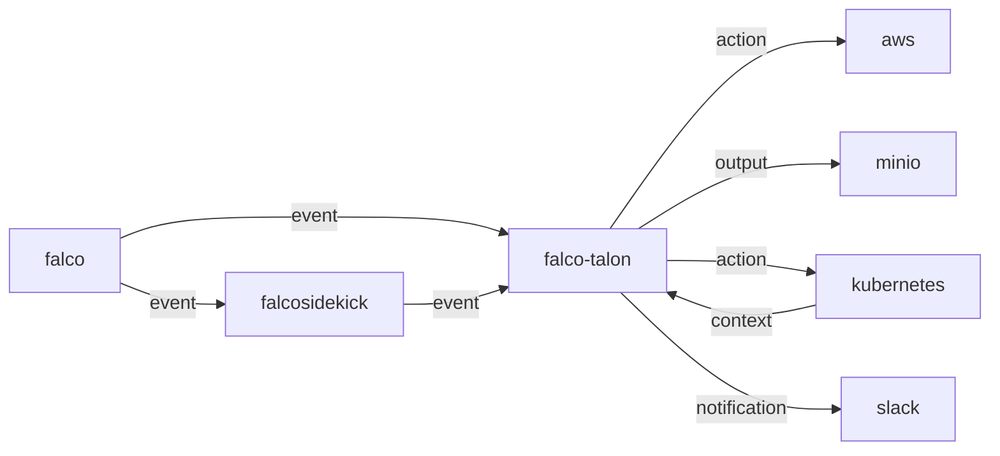

 # Falco Talon

[](https://github.com/falcosecurity/evolution/blob/main/REPOSITORIES.md#ecosystem-scope) [](https://github.com/falcosecurity/evolution/blob/main/REPOSITORIES.md#incubating)
[](https://github.com/falcosecurity/falco-talon/releases/latest)


`Falco Talon` is a Response Engine for managing threats in your Kubernetes. It enhances the solutions proposed by the Falco community with a no-code tailor made solution. With easy rules, you can react to `events` from [`Falco`](https://falco.org) in milliseconds.

- [Falco Talon](#falco-talon)
  - [Architecture](#architecture)
    - [Glossary](#glossary)
    - [Actionners](#actionners)
    - [Notifiers](#notifiers)
    - [Outputs](#outputs)
    - [Configuration](#configuration)
    - [Rules](#rules)
  - [Documentation](#documentation)
  - [Metrics](#metrics)
    - [Prometheus metrics](#prometheus-metrics)
    - [OTEL metrics](#otel-metrics)
  - [Traces](#traces)
  - [Docker images](#docker-images)
  - [Deployment](#deployment)
    - [Helm](#helm)
      - [Configure Falcosidekick](#configure-falcosidekick)
  - [Development](#development)
  - [License](#license)
  - [Author](#author)

## Architecture

`Falco Talon` can receive the `events` from [`Falco`](https://falco.org) or [`Falcosidekick`](https://github.com/falcosecurity/falco-talon):



### Glossary

* `event`: an event detected by `Falco` and sent to its outputs
* `rule`: defines criterias for linking the events with the actions to apply
* `action`: each rule can sequentially run actions, each action refers to an actionner
* `actionner`: defines what the action will do
* `notifier`: defines what outputs to notify with the result of the action
* `context`: composed of elements from the original Falco event, from Falco Talon and other sources, these elements can be used to dynamically configure the actions to perform.
* `output`: defines the target where to store the resulting artifact that might has been created by an actionner

### Actionners

The list of the available actionners can be found [HERE](https://docs.falco-talon.org/docs/actionners/list/).

### Notifiers

The list of the available actionners can be found [HERE](https://docs.falco-talon.org/docs/notifiers/list/).

### Outputs

The list of the available outputs can be found [HERE](https://docs.falco-talon.org/docs/outputs/list/).

### Configuration

The static configuration of `Falco Talon` is set with a `.yaml` file (default: `./config.yaml`) or with environment variables.

The list of the available settings can be found [HERE](https://docs.falco-talon.org/docs/configuration/).

### Rules

You can find how to write your own rules [HERE](https://docs.falco-talon.org/docs/rules/).

## Documentation

The full documentation is available on its own website: [https://docs.falco-talon.org/docs](https://docs.falco-talon.org/docs).

## Metrics

### Prometheus metrics

The `/metrics` endpoint exposes some metrics in the Prometheus format. See [here](https://docs.falco-talon.org/docs/installation_usage/metrics#prometheus-metrics).

### OTEL metrics

`Falco Talon` can export its metrics in the OTEL Metrics format. See [here](https://docs.falco-talon.org/docs/installation_usage/metrics#otel-metrics).

## Traces

`Falco Talon` can export traces in the OTEL Traces format. See [here](https://docs.falco-talon.org/docs/installation_usage/traces).

## Docker images

The docker images for `falco-talon` are built using [ko](https://github.com/google/ko)

To generate the images to test locally you can run `mage buildImagesLocal`

## Deployment

### Helm

The helm chart is available in the folder [`deployment/helm`](https://github.com/falcosecurity/falco-talon/tree/main/deployment/helm).
Two config files are provided:
* `values.yaml` allows you to configure `Falcon Talon` and the deployment
* `rules.yaml` contains rules to set

```shell
cd deployment/helm/
helm install falco-talon . -n falco --create-namespace
```

#### Configure Falcosidekick

Once you have installed `Falco Talon` with Helm, you need to connect `Falcosidekick` by adding the flag `--set falcosidekick.config.webhook.address=http://falco-talon:2803`

```shell
helm install falco falcosecurity/falco --namespace falco \
  --create-namespace \
  --set tty=true \
  --set falcosidekick.enabled=true \
  --set falcosidekick.config.talon.address=http://falco-talon:2803
```

## Development

A [Docker Compose stack](./deployment/compose) is provided for local developments and tests. 

This stack starts these services:
- **Grafana**: accessible at http://localhost:3000
- **OTEL Collector**
- **Prometheus**: accessible at http://localhost:9090
- **Grafana Tempo**
- **Minio**: accessible at http://localhost:9001 (root/changeme123)

To start the stack:
```shell
cd deployment/compose
docker compose up -d
```

## License

Falco Talon is licensed to you under the [Apache 2.0](./LICENSE) open source license.

## Author

Thomas Labarussias (https://github.com/Issif)

